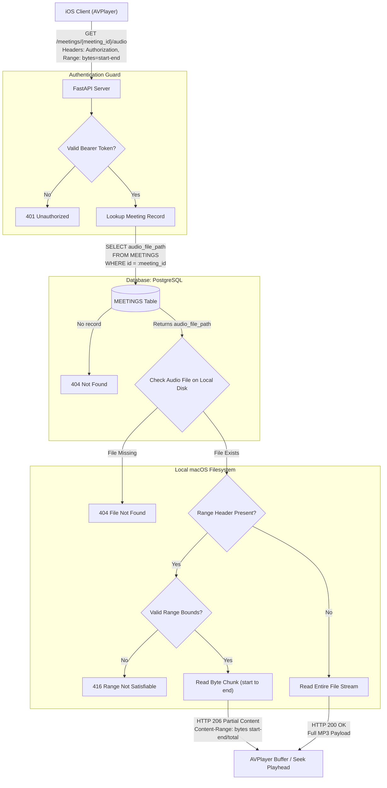

The Audio Playback & Deep-Linking Engine is the AVFoundation-powered media controller inside the native iOS client that binds raw audio buffers directly to structured text, transcripts, tasks, and conversational RAG citations. Built around `AVPlayer` and Core Media's `CMTime`, it turns static meeting notes into an interactive, verifiable audio archive.

**Sub-Second Playhead Seeking via CMTime**
- Converts integer millisecond offsets stored in the database (`start_time_ms`, `evidence_timestamp_ms`, `timestamp_ms`) into Apple's rational time structure `CMTime(value:timescale:)`.
- Dispatches `player.seek(to: CMTime)` requests to jump playback immediately to the exact word or speech turn, eliminating manual timeline scrubbing.
- Uses non-blocking Swift concurrency to coordinate playhead adjustments without stalling the main UI thread.
    
**Cross-View Deep Linking & Source Verification**
- **Transcript Feed Scrubbing:** In the Meeting Detail view, tapping any diarized attendee utterance cues playback directly to that speaker turn.
- **Task Card Evidence Checks:** Extracted task review cards display verbatim quotes and timestamps; tapping them cues audio to the moment an action item was committed, enabling verification before the user taps Approve, Edit, or Dismiss.
- **Consensus Decision Proof:** Tapping a settled decision in the summary ledger scrubs to the discussion where that conclusion was finalized.
- **RAG Chat Citation Chips:** Assistant responses render inline citation badges (e.g., `[Meeting #3 @ 14:22]`) that directly load the source meeting audio and seek to the supporting timestamp.

**State Synchronization & Active Highlight Engine**

- Registers periodic time observers on `AVPlayer` to sample the current playback position at sub-second intervals.
- Evaluates playback progress against transcript boundaries (`start_time_ms` to `end_time_ms`) to dynamically highlight the active speaker turn in the SwiftUI feed.
- Emits reactive state updates (playing, paused, buffering, scrubbed) across the 3-axis dashboard to ensure playhead controls stay unified.

**Session Management & Audio Routing**

- Manages `AVAudioSession` configurations to gracefully handle system interruptions (such as incoming phone calls or Siri activation) and resume playback cleanly.
- Feeds off local cached audio files or streams via the secure Cloudflare/Tailscale tunnel, keeping playback responsive without forcing full redownloads.

## API Specification
| **Endpoint**                     | **Method** | **Auth Required** | **Request Body / Query**                                                                                         | **Status Codes**                                                                                                                                    | **Description**                                                                                                                                                              |
| -------------------------------- | ---------- | ----------------- | ---------------------------------------------------------------------------------------------------------------- | --------------------------------------------------------------------------------------------------------------------------------------------------- | ---------------------------------------------------------------------------------------------------------------------------------------------------------------------------- |
| `/meetings/ {meeting_id}/ audio` | `GET`      | Yes               | **Headers:** `Range: bytes={start}-{end}` (optional for byte chunking)  `Authorization: Bearer <TOKEN>` | `200 OK` (full file)  `206 Partial Content` (byte stream)  `401 Unauthorized`  `404 Not Found`  `416 Range Not Satisfiable` | Streams the normalized MP3 recording using byte-range chunking, allowing `AVPlayer` to buffer dynamically and seek playheads without downloading the full audio file upfront |

## API Connection

