The Native Presentation System (SwiftUI) is the client-side interface of the app, organizing meeting artifacts into a 3-tab navigation hierarchy—Meetings, Tasks, and Chat—while coordinating audio playback, consent checks, and background pipeline states.

**1. Meetings View & Meeting Detail Hub** Serves as the app’s default landing screen, structured to handle multi-project tracking and meeting inspection:

- **Project & Session Management:** Displays visual project cards with customized images and titles, supports adding new projects, and lists each project's associated meetings annotated with meeting dates, audio durations, and source file metadata.
    
- **Consent Gating & Ingestion:** Prompts users with a mandatory consent gating modal that blocks upload execution until participant recording consent is explicitly verified, taking files shared via iOS Document Picker or System Share Sheets.
    
- **Summary & Decisions View:** Displays LLM-generated meeting takeaways alongside a structured consensus ledger detailing explicit decisions reached during the conversation.
    
- **Human-in-the-Loop Task Review:** Renders a card stack of AI-extracted action items attributed to specific speakers with their profile initials, suggested due dates, and verbatim transcript citations as proof. Users can individually **Approve**, **Edit**, or **Dismiss** each item.
    
- **Interactive Transcript Feed:** Presents a diarized conversational turn feed labeled by attendee names and initials, with timestamps linked directly to playback.
    
- **Attendee Storylines:** Lists all detected participants; tapping an attendee opens their subjective storyline detailing their point of view on _what they want_, _what they see_, and _what they discuss_.
    

**2. Tasks View (Calendar & State Machine)** Acts as an operational calendar dashboard that aggregates tasks approved from the Meetings view:

- **Multi-Scale Calendar Component:** Provides scrolling across years, months, and days to visualize deadlines and deliverables.
    
- **3-State Lifecycle Controls:** Tasks default to the **Open** state; tapping the check button marks the task as **Done**, while tapping the trash button transitions it to **Dropped**.
    
- **Workstream Filtering:** Includes project-level filters so users can isolate commitments tied to a single project or view all active tasks.
    
- **EventKit Synchronization:** Triggers updates directly to native Apple Reminders and Apple Calendar upon task approval.
    

**3. Chat View (Project-Scoped RAG Interface)** Provides conversational retrieval over historical meeting sessions:

- **Natural Language Meeting Q&A:** Allows users to query the local vector and full-text database across previous syncs.
    
- **Inline Citation Chips:** Renders verifiable reference tags (displaying meeting name and timestamp) that allow users to jump straight to the source audio.
    
- **Grounded Refusal Display:** Natively surfaces explicit refusal messages (displaying "I don't know") when queries fall outside the bounds of recorded context.
    
- **Chat History & Project Filtering:** Manages prior chat threads, allowing users to start new sessions or filter conversational histories between "All" and specific project boundaries.
    

**4. Performance & Concurrency Architecture**

- **Non-Blocking Concurrency:** Built with Swift 6 modern concurrency (`async/await`, `TaskGroup`, `Actors`) to parse large transcript arrays and render LLM streaming responses without freezing the main UI thread.
    
- **Real-Time Processing Progress:** Integrates with backend WebSockets via `URLSessionWebSocketTask` to render live pipeline status cards (_"Transcribing..."_, _"Diarizing..."_, _"Extracting Tasks..."_) while heavy sequential workloads process on the backend.

## API specification

### api/v1

| **Endpoint**                      | **Method** | **Auth Required** | **Request Body / Query**                                                                                                               | **Status Codes**                                                                                    | **Description**                                                                                                                                                                                               |
| --------------------------------- | ---------- | ----------------- | -------------------------------------------------------------------------------------------------------------------------------------- | --------------------------------------------------------------------------------------------------- | ------------------------------------------------------------------------------------------------------------------------------------------------------------------------------------------------------------- |
| `/projects`                       | `GET`      | Yes               | _None_                                                                                                                                 | `200 OK`, `401 Unauthorized`                                                                        | Fetches all tracked projects with metadata, card images, and meeting counts for the primary landing screen.                                                                                                   |
| `/projects`                       | `POST`     | Yes               | **Body (JSON):** `{ "name": string, "image_path": string? }`                                                                        | `201 Created`, `400 Bad Request`, `401 Unauthorized`                                                | Creates a new project scoping boundary for grouping meetings, tasks, and search retrieval.                                                                                                                    |
| `/projects/{project_id}/meetings` | `GET`      | Yes               | **Query:** `limit: int?`, `offset: int?`                                                                                            | `200 OK`  `401 Unauthorized`  `404 Not Found`                                           | Lists meeting cards under a target project, annotated with meeting dates, audio durations, and source file metadata.                                                                                          |
| `/meetings/upload`                | `POST`     | Yes               | **Multipart Form:** `file: audio/mp3`, `project_id: UUID`, `consent_confirmed: bool`                                                | `202 Accepted`  `400 Bad Request`  `401 Unauthorized`  `422 Unprocessable Entity` | Enforces consent gating verification; queues audio normalization and sequential processing in the async worker; returns `job_id` and initial meeting metadata.                                                |
| `/ws/pipeline/{job_id}`           | `WS`       | Yes               | **Query:** `token: string`                                                                                                          | `101 Switching Protocols`  `4001 Unauthorized`                                                | Streams real-time pipeline progression events (_"Transcribing..."_, _"Diarizing..."_, _"Extracting Tasks..."_, _"Complete"_) over a persistent WebSocket.                                                     |
| `/meetings/{meeting_id}`          | `GET`      | Yes               | _None_                                                                                                                                 | `200 OK`  `401 Unauthorized`  `404 Not Found`                                           | Retrieves the meeting detail payload: structured summary bullets, consensus decisions ledger, diarized transcript turns, and attendee storylines (_what they want, see, discuss_).                            |
| `/meetings/{meeting_id}`          | `DELETE`   | Yes               | _None_                                                                                                                                 | `200 OK`  `401 Unauthorized`  `404 Not Found`                                           | Purges relational meeting records and safely moves the source audio file to macOS `~/.Trash` via `send2trash` for recoverable deletion.                                                                       |
| `/tasks`                          | `GET`      | Yes               | **Query:** `project_id: UUID?`, `start_date: date?`, `end_date: date?`, `status: string?`                                           | `200 OK`  `401 Unauthorized`                                                                  | Fetches tasks filtered across year, month, and day ranges to render the operational calendar view and project-specific workstreams.                                                                           |
| `/tasks/{task_id}`                | `PATCH`    | Yes               | **Body (JSON):** `{ "action": "approve"/ "edit"/ "dismiss", "assignee_id": UUID?, "task_description": string?, "due_date": date? }` | `200 OK`  `400 Bad Request`  `401 Unauthorized`  `404 Not Found`                  | Executes human-in-the-loop review actions on generated task cards; returns formatted payloads to sync approved tasks directly into Apple Reminders and Calendar via EventKit.                                 |
| `/tasks/{task_id}/state`          | `POST`     | Yes               | **Body (JSON):** `{ "status": "open"/"done"/ "dropped" }`                                                                           | `200 OK`  `400 Bad Request`  `401 Unauthorized`   `404 Not Found`                 | Updates the task across its 3 explicit lifecycle states; appends the state diff to `task_audit_log` and returns a revert token.                                                                               |
| `/tasks/{task_id}/revert`         | `POST`     | Yes               | **Body (JSON):** `{ "revert_token": string }`                                                                                       | `200 OK`  `400 Bad Request`  `401 Unauthorized`  `404 Not Found`                  | Undoes a task status mutation by verifying the cryptographic revert token against the immutable audit ledger.                                                                                                 |
| `/chat/sessions`                  | `GET`      | Yes               | **Query:** `project_id: UUID?`                                                                                                      | `200 OK`  `401 Unauthorized`                                                                  | Retrieves conversational history threads, supporting both global "all" session listings and project-filtered views.                                                                                           |
| `/chat/sessions`                  | `POST`     | Yes               | **Body (JSON):** `{ "project_id": UUID?, "title": string }`                                                                         | `201 Created`   `400 Bad Request`  `401 Unauthorized`                                   | Initializes a new RAG chat conversation thread.                                                                                                                                                               |
| `/rag/query`                      | `POST`     | Yes               | **Body (JSON):** `{ "session_id": UUID, "project_id": UUID?, "meeting_id": UUID?, "query": string }`                                | `200 OK`  `400 Bad Request`  `401 Unauthorized`  `404 Not Found`                  | Runs hybrid dense/sparse search (pgvector + BM25) strictly scoped to the project or meeting boundary; returns LLM-grounded answers with audio seek timestamps or an explicit _"I don't know"_ refusal string. |
## Database Setup

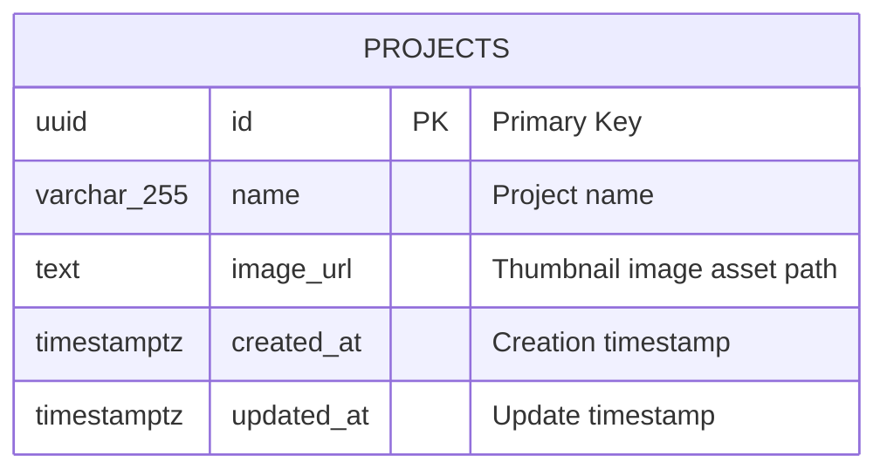

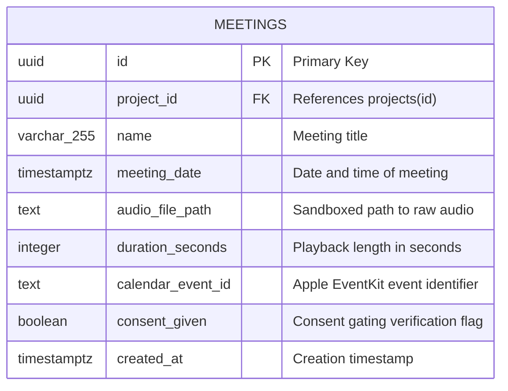

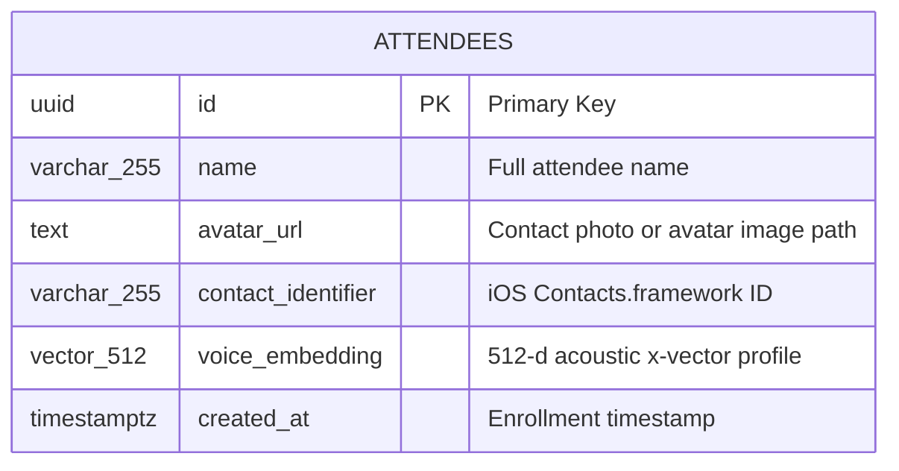

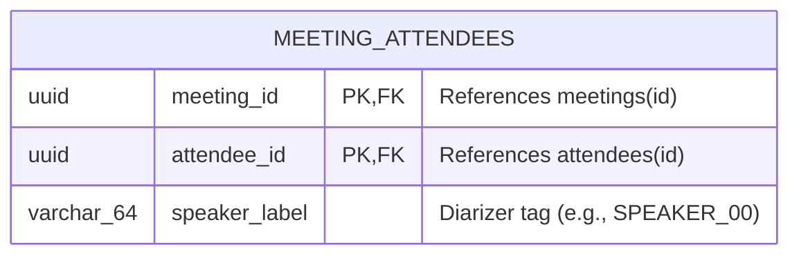

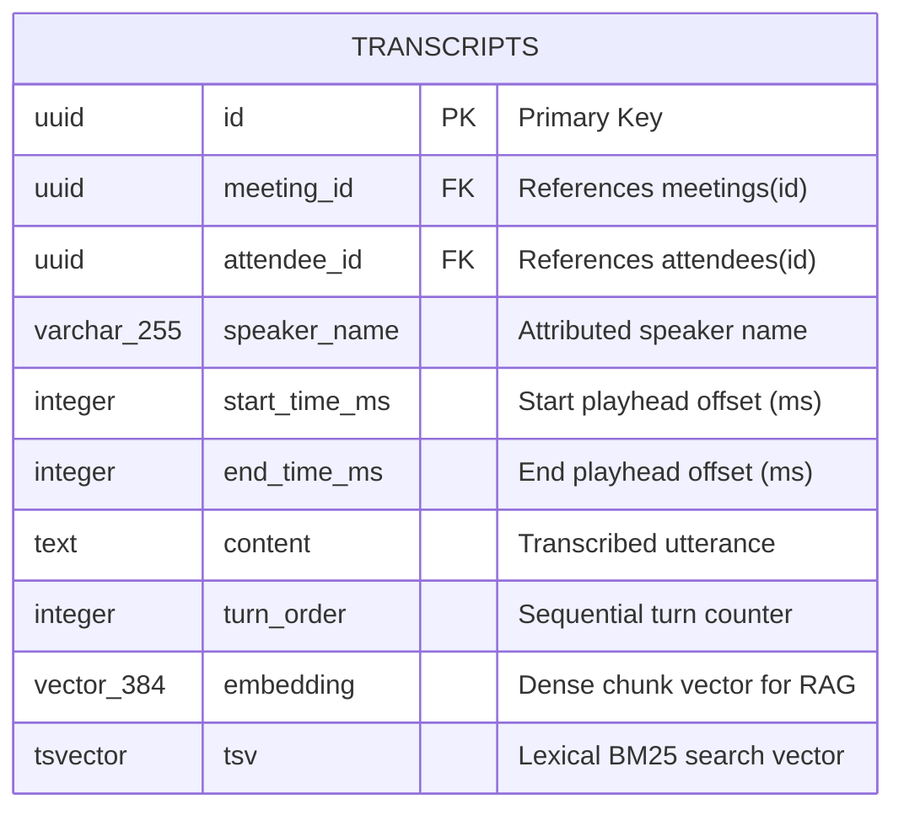

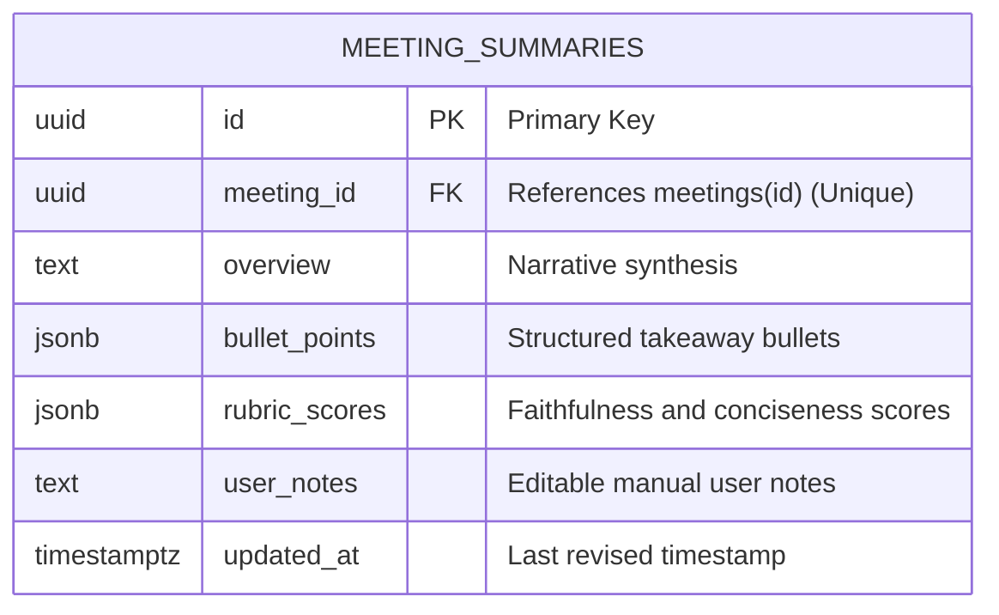

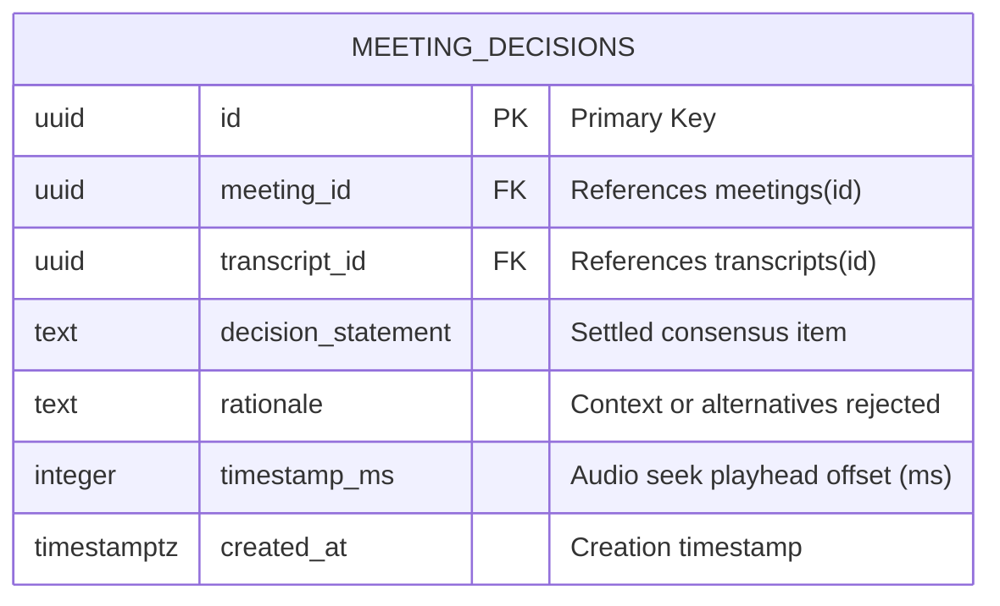

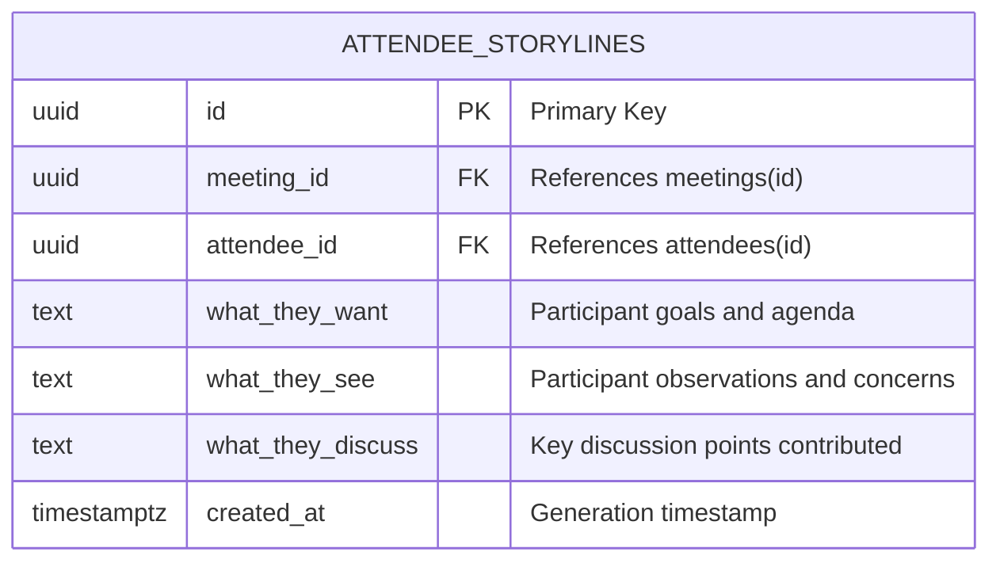

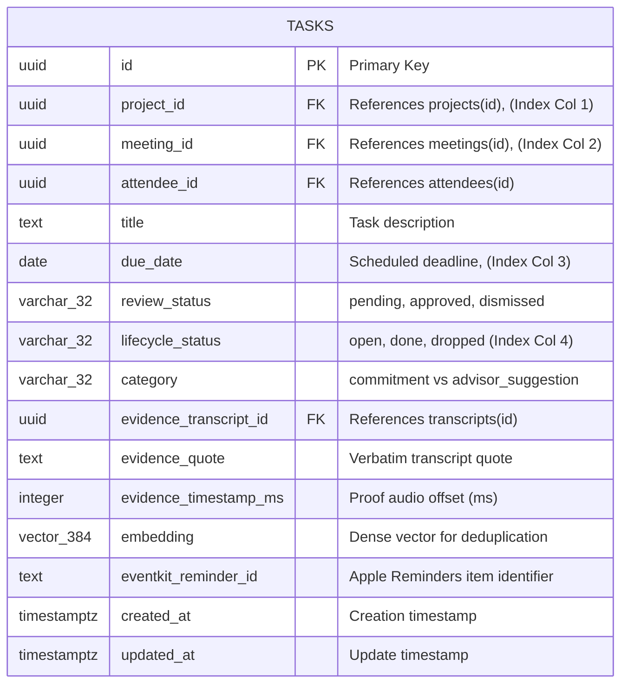

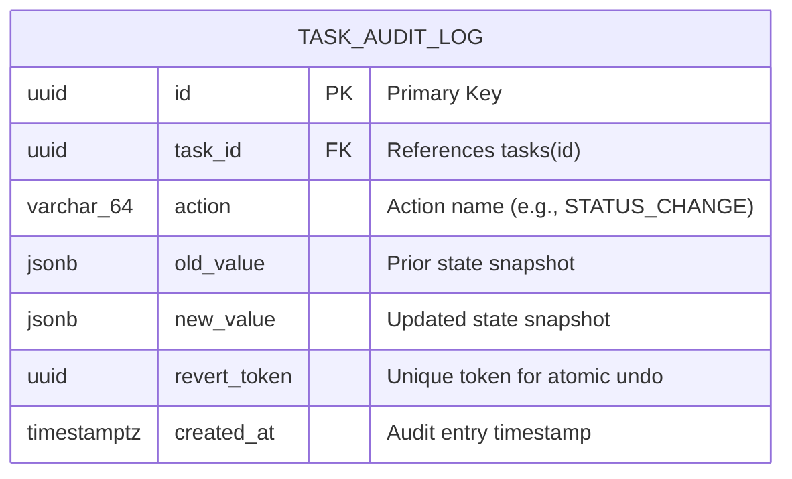

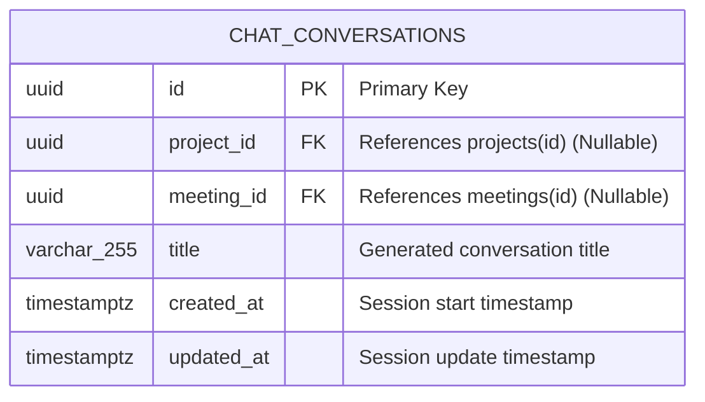

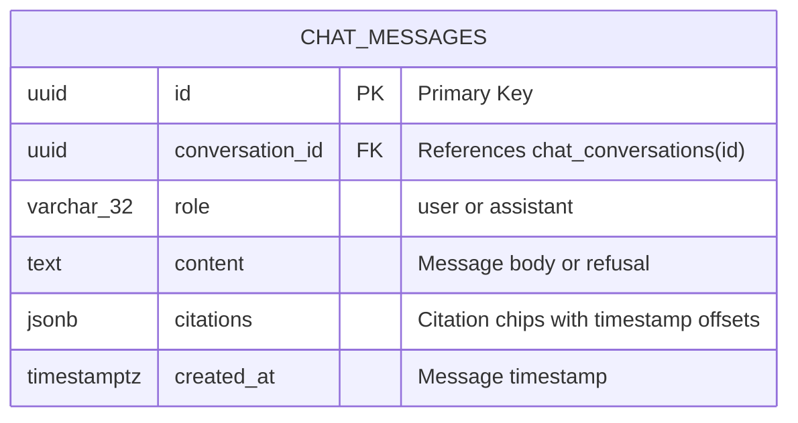

## Database Connection

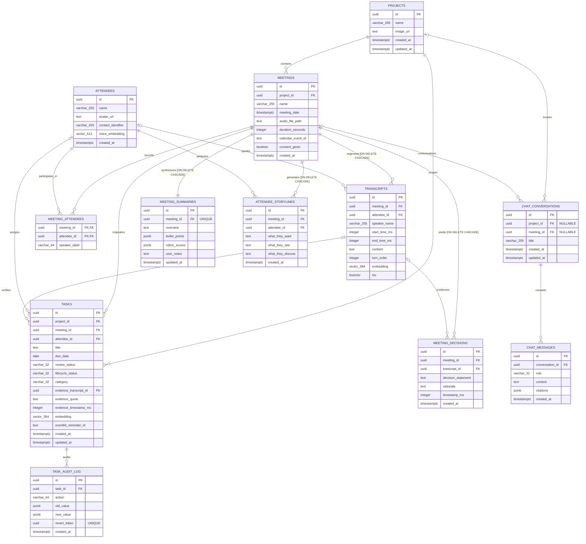

